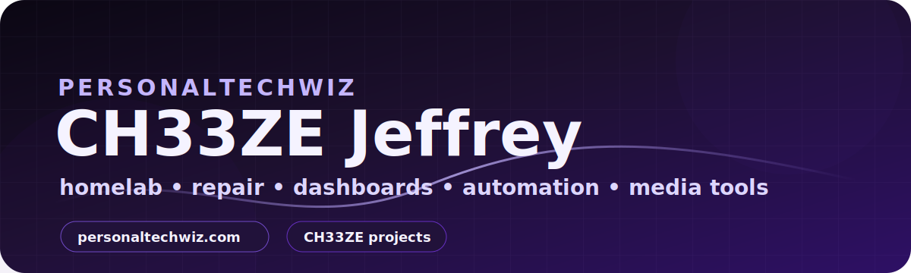

  

<h1 align="center">CH33ZE Jeffrey</h1>

  <strong>PersonalTechWiz • homelab builder • repair tech • self-taught systems maker</strong>

  <a href="https://personaltechwiz.com"><strong>personaltechwiz.com</strong></a>
  ·
  <a href="https://github.com/CH33ZELOUIZ/homelab-projects">Homelab Projects</a>
  ·
  <a href="https://github.com/CH33ZELOUIZ?tab=repositories">Repositories</a>

  
  
  

---

## What I build

I build and document practical systems around repair, self-hosting, automation, media, games, dashboards, and useful tools. My GitHub is the archive for CH33ZE projects and PersonalTechWiz work.

| Area | What I work on |
| --- | --- |
| **Homelab systems** | Linux servers, Docker stacks, dashboards, monitoring, storage, and secure remote access |
| **Media automation** | Jellyfin, Jellyseerr, Servarr, qBittorrent, Prowlarr, Live TV, DVR cleanup, and import pipelines |
| **Game libraries** | ROM/library tooling, RomM integrations, Minecraft server tooling, and console-focused search workflows |
| **Catalog apps** | LEGO/inventory-style apps with clean web UIs, images, metadata, and review workflows |
| **Repair / PersonalTechWiz** | Tech repair, hardware/software troubleshooting, device projects, and documentation |

---

## Featured CH33ZE projects

<table>
<tr>
<td width="50%">

### 🎮 GameFinder

Console/ROM-focused search and add workflow that connects Prowlarr, qBittorrent, and RomM-style libraries.

<a href="https://github.com/CH33ZELOUIZ/gamefinder">Open repo →</a>

</td>
<td width="50%">

### 🧰 Minecraft Server Dashboard

A compact Docker/RCON dashboard pattern for managing a self-hosted Minecraft server.

<a href="https://github.com/CH33ZELOUIZ/minecraft-server-dashboard">Open repo →</a>

</td>
</tr>
<tr>
<td width="50%">

### 🧱 LEGO Catalog

Self-hosted catalog app pattern for tracking sets/minifigures with images, notes, and review states.

<a href="https://github.com/CH33ZELOUIZ/lego-catalog">Open repo →</a>

</td>
<td width="50%">

### 🏠 Homelab Projects

Index of reusable CH33ZE homelab templates, setup guides, architecture notes, and operations patterns.

<a href="https://github.com/CH33ZELOUIZ/homelab-projects">Open repo →</a>

</td>
</tr>
<tr>
<td width="50%">

### 🎬 Media Automation Stack Template

Docker Compose template and docs for a media automation stack with VPN-aware service wiring.

<a href="https://github.com/CH33ZELOUIZ/media-automation-stack-template">Open repo →</a>

</td>
<td width="50%">

### 👤 Jellyfin Signup Helper

Reusable helper pattern for guided Jellyfin account/signup workflows.

<a href="https://github.com/CH33ZELOUIZ/jellyfin-signup-helper">Open repo →</a>

</td>
</tr>
</table>

---

## Stack I use often

  
  
  
  
  
  
  

---

## Current focus

- Building a clean public CH33ZE project archive people can copy from.
- Keeping PersonalTechWiz/homelab work documented instead of scattered.
- Turning real working server tools into reusable templates.
- Improving dashboards, monitoring, media workflows, and repair documentation.

---

  <strong>Website:</strong> <a href="https://personaltechwiz.com">personaltechwiz.com</a>

